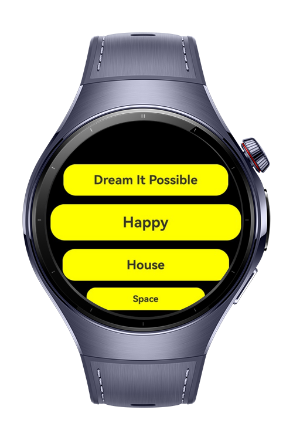
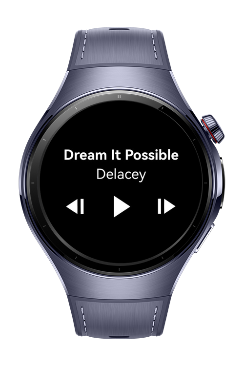

> **Note:** To access all shared projects, get information about environment setup, and view other guides, please visit [Explore-In-HMOS-Wearable Index](https://github.com/Explore-In-HMOS-Wearable/hmos-index).

# Audio Player

This is a simple music player application demonstrating basic audio playback capabilities. The app provides Music file browsing and playback and Playback controls

# Preview

<p align="left">
  
  
</p>

# Use Cases

- Music file browsing and playback
- Playback controls

# Tech Stack

- **Languages**: ArkTS, Typescript
- **Frameworks**: HarmonyOS SDK 5.1.0(18)
- **Tools**: DevEco Studio Vers 5.1.0.842
- **Libraries**: @kit.MediaKit, @kit.AudioKit, @kit.AbilityKit


# Directory Structure

```entry/src/main/ets/
|---core
| |---services
| | |---BaseViewModel.ets # Base view model
| | |---RouteService.ets # Route Service
| | |---AudioService.ets 
| |---models
| | |---SingleMenuItemModel.ets
| | |---SongModel.ets
|---entryability
| |---EntryAbility.ets
|---entrybackupability
| |---EntryBackupAbility.ets  
|---ui
| |---pages
| | |---AudioView.ets 
| | |---Home.ets 
| |---viewmodels
| | |---AudioViewViewModel.ets 
| | |---HomeViewModel.ets 
```

# Constraints and Restrictions
## Supported Devices
- Huawei Watch 5


# LICENSE

Audio Player is distributed under the terms of the MIT License.
See the [LICENSE](/LICENSE) for more information.
